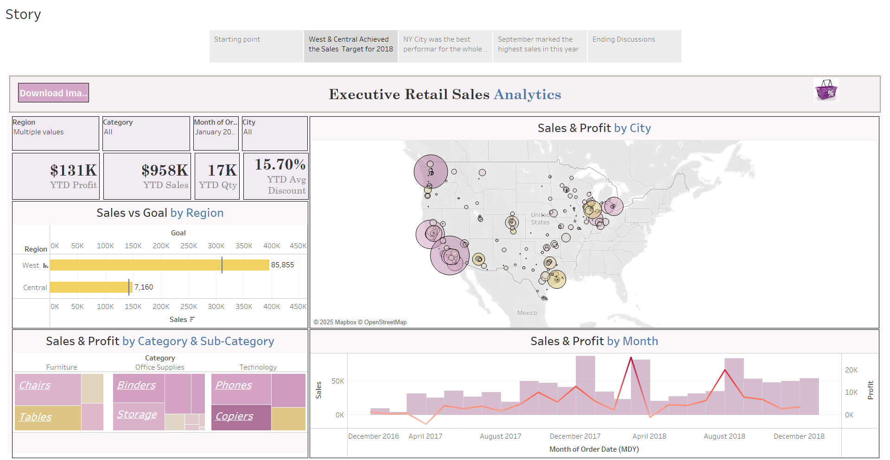
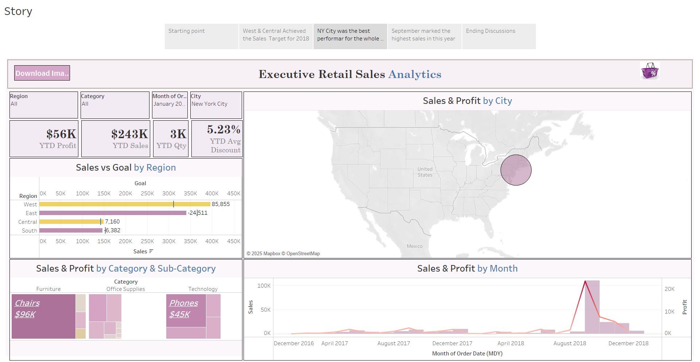
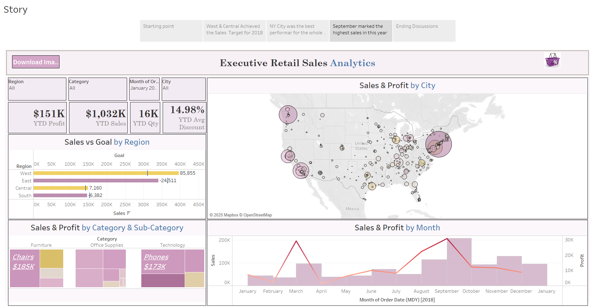

# Retail_Sales_Analysis
# Retail Sales Dashboard

## Project Overview

This Tableau project, Retail Sales Dashboard, is designed to analyze and visualize key retail sales metrics. It helps in tracking sales performance, identifying trends, and making data-driven business decisions.

## Features

Sales Overview: Displays total sales, revenue, and profit trends.

Product Analysis: Highlights best-selling and underperforming products.

Customer Insights: Shows customer segmentation based on purchase behavior.

Regional Performance: Visualizes sales by location to identify high and low-performing areas.

Time-Series Analysis: Tracks sales trends over time for better forecasting.

## Dataset Used

The dashboard is built using retail sales data that includes:

Order ID, Date, and Region

Product Category and Sub-category

Customer Information

Sales, Profit, and Discounts

## Story

- West & Central Achieved the Sales  Target for 2018.

- NY City was the best performar for the whole period.

- September marked the highest sales in this year.

## Requirements

To view and interact with the dashboard, you need:

Tableau Desktop or Tableau Public installed on your system.

## How to Use

1. Open the Retail_Sales_Dashboard.twbx file in Tableau.

2. Explore the interactive visualizations by filtering data based on regions, products, or time periods.

3. Gain insights into sales trends and make informed decisions based on the analysis.

## Future Enhancements

Adding predictive analytics for sales forecasting.

Integrating real-time data updates.

Enhancing visualizations with more advanced Tableau features.

